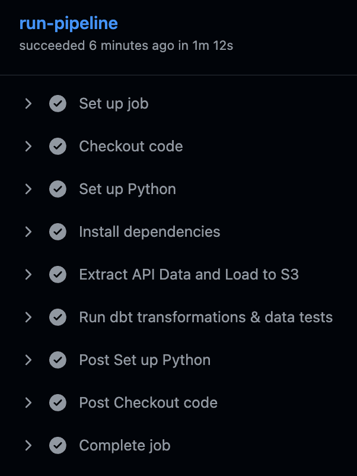
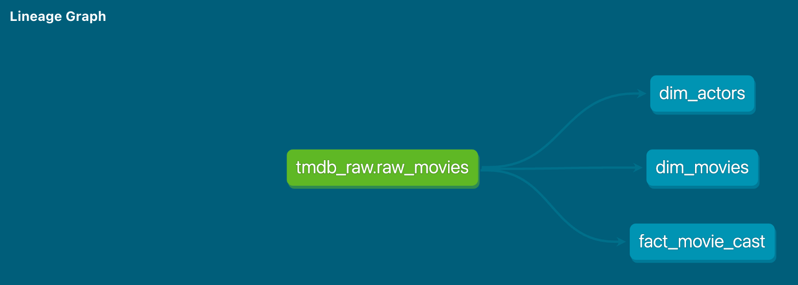
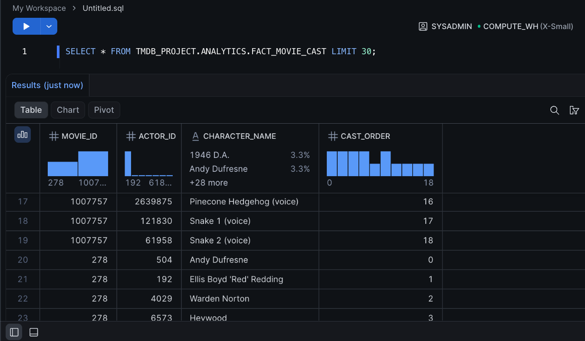

# TMDB Automated ELT Pipeline

An automated Data Engineering pipeline that extracts top-rated movies and their complex cast data from the TMDB API, loads it into an AWS S3 Data Lake, and transforms it into a Star Schema in Snowflake using dbt.

## Architecture

1. **Extract**: Python script fetches deeply nested JSON data (movies + credits) from TMDB API.
2. **Load**: The raw JSON is pushed to an AWS S3 bucket, partitioned by execution date. Snowflake ingests this data via an external Stage using a dynamic dbt pre-hook.
3. **Transform**: `dbt` transforms the raw JSON into a relational Star Schema (`dim_movies`, `dim_actors`, `fact_movie_cast`), applying deduplication and data quality tests.
4. **Orchestrate**: GitHub Actions automates the entire daily pipeline.

## Tech Stack
* **Python 3.10** (Requests, Boto3)
* **AWS S3** (Data Lake)
* **Snowflake** (Data Warehouse)
* **dbt (Data Build Tool)** (Transformations & Testing)
* **GitHub Actions** (CI/CD & Orchestration)

## Data Model (Star Schema)
* `dim_movies`: Movie details (rating, release date, popularity).
* `dim_actors`: Unique list of actors.
* `fact_movie_cast`: Links actors to movies along with their specific character names.

## Proof of Execution

### 1. Automated CI/CD Pipeline (Github Actions)
The entire pipeline runs successfully on a schedule, executing extraction, loading, and dbt testing.

### 2. Data Modeling (dbt Lineage Graph)
Transforming the raw, nested JSON into a clean Star Schema.

### 3. Data Warehouse (Snowflake)
The final `fact_movie_cast` table populated with relational data, ready for BI reporting.

